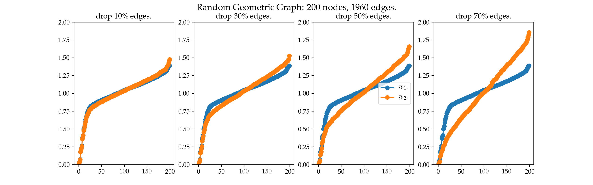

# GNN-Over-Smoothing
This is code for paper `A Note on Over-Smoothing for Graph Neural Networks`, which is accepted as ICML 2020 graph representation learning ([GRL+](https://grlplus.github.io/overview/)) workshop.

### Abstract
Graph Neural Networks (GNNs) have achieved a lot of success on graph-structured data. 
However, it is observed that the performance of graph neural networks does not improve as the number of layers increases. 
This effect, known as over-smoothing has been analyzed mostly in linear cases. 
In this paper, we build upon previous results \cite{oono2019graph} to further analyze the over-smoothing effect in the general graph neural network architecture. 
We show when the weight matrix satisfies the conditions determined by the spectrum of augmented normalized Laplacian, the Dirichlet energy of embeddings will converge to zero, resulting in the loss of discriminative power.
Using Dirichlet energy to measure ``expressiveness" of embedding is conceptually clean; it leads to simpler proofs than \cite{oono2019graph} and can handle more non-linearities. 

### Install
The code is tested on python=3.7.6, torch-geometric=1.5.0 and networkx=2.4.

`python oversmoothing/main.py --show --n_eig 200 --eigenvalue` will generate the follwing figure.

### Citation
If you are using the code, please consider citing our paper.